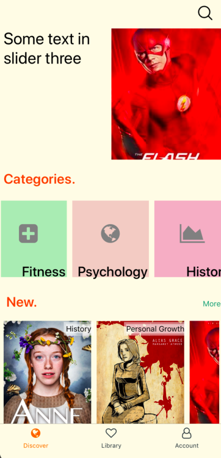
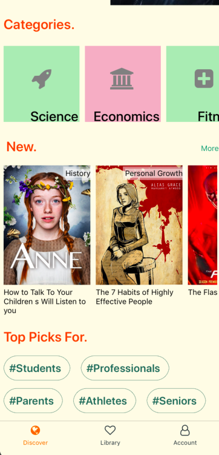
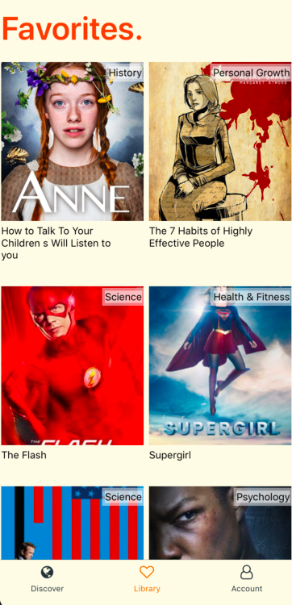
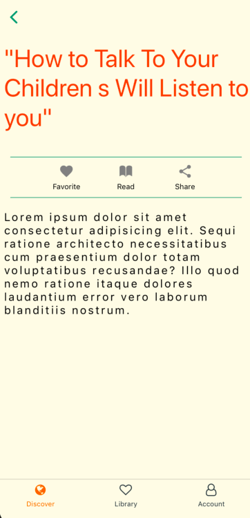
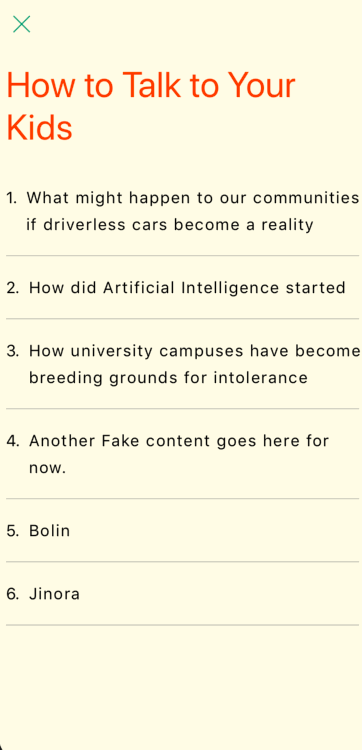
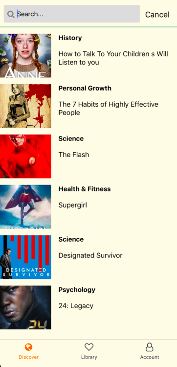
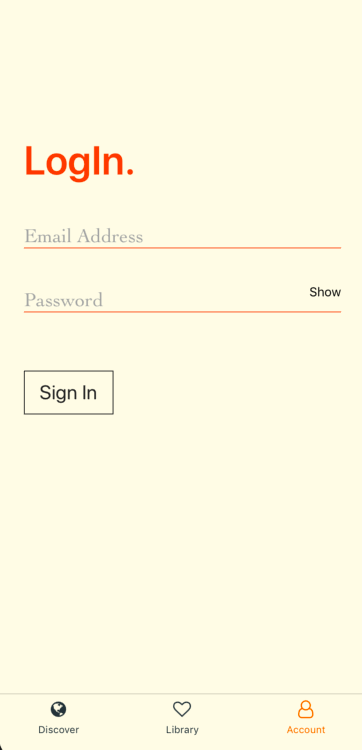

<table>
  <tr>
    <td></td>
    <td></td>
    <td></td>
  </tr>
  <tr>
    <td></td>
    <td></td>
    <td></td>
  </tr>
  <tr>
    <td></td>
    <td></td>
    <td></td>
  </tr>
</table>

## How to use

```
yarn install
yarn start
```

## About the project

The project is targeted for implementing content sharing platform, where user will be able to read and listen short articles.

Inspired from apps like Blinkist, Story, & Audible!

Information architecture patterns have been given a major attention, so that a user can easily search around their favorite contents.

It is developing with React Native.

I'll be happy if you could provide me any feedback about the project, code, its structure or anything that could make me a better developer!

aung@aungthet.com

## Upcoming functions & features

- Lazy loading contents
- Switching to Hooks
- Audio streaming
- Optimising SASS
- Favoriting articles with Optimistic Update
- OAuth login
- Multiple Filtering
- & more 🤩
- ...
