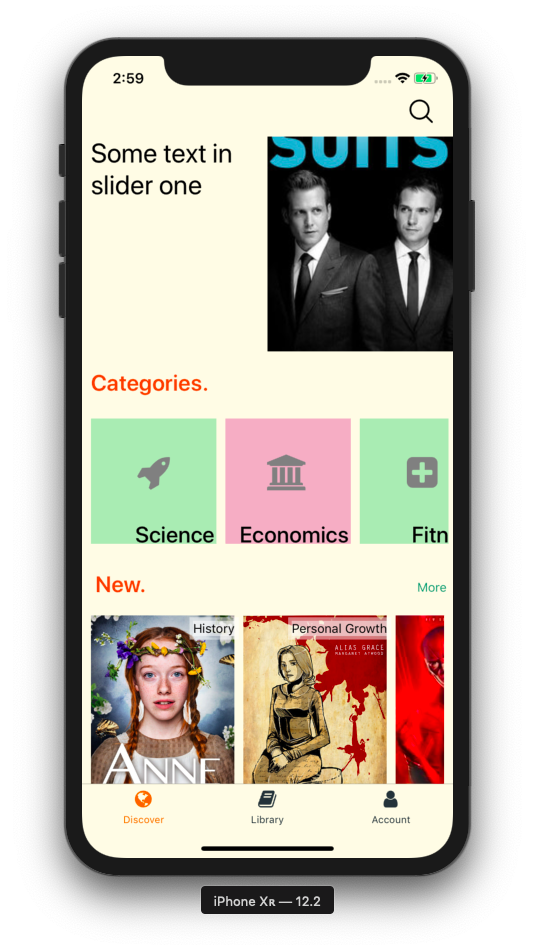
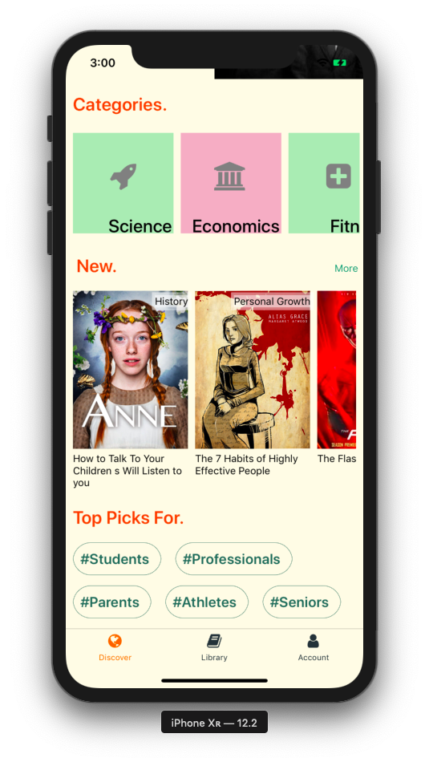
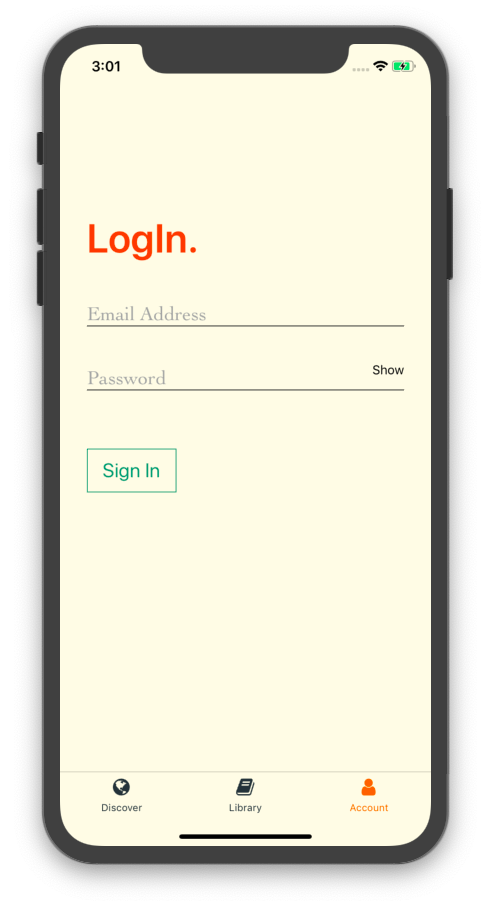
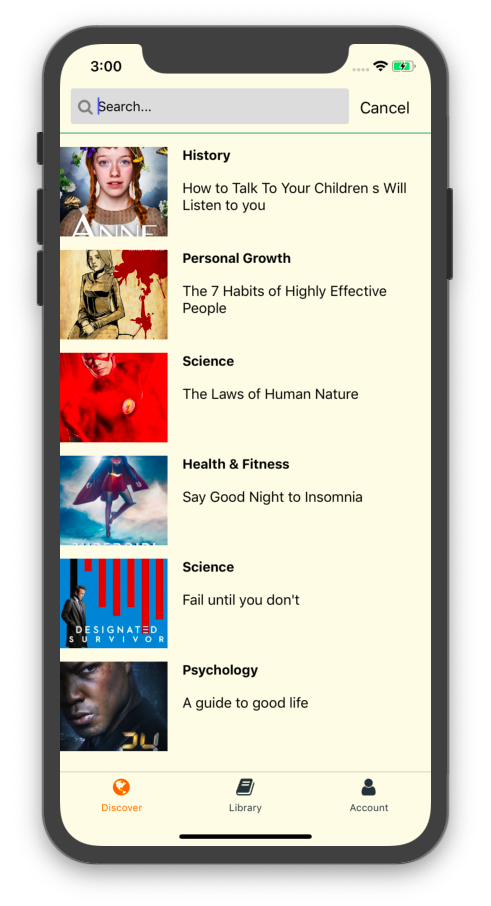

<table>
  <tr>
    <td></td>
    <td></td>
    <td></td>
    <td></td>
  <tr>
</table>

## How to use

```
yarn install
yarn start
```

## About the project

The project is targeted for implementing content sharing platform, where user will be able to read and listen short articles.

Information architecture patterns have been given a major attention, so that a user can easily search around their favorite contents.

It is developing with React Native.

## Upcoming functions & features

- Lazy loading contents
- Integrating Redux
- Audio streaming
- Optimising SASS
- Favoriting articles
- ...
